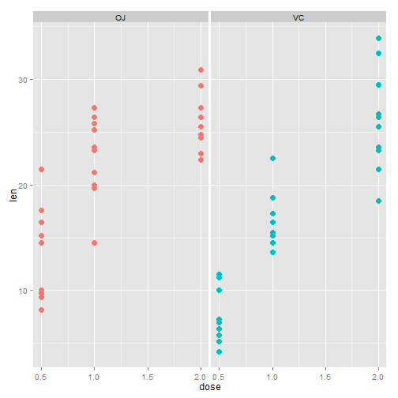
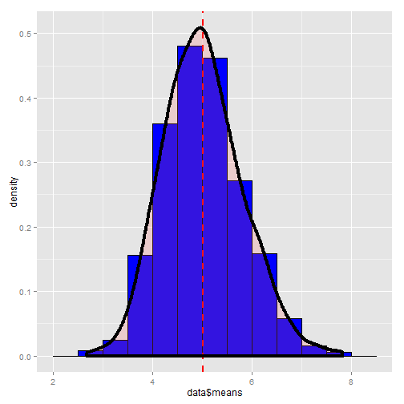
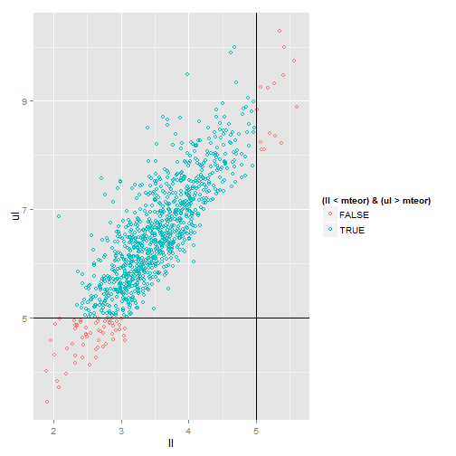

The project for the statistical inference class
========================================================
The project consists of two parts:

1. Simulation exercises.
2. Basic inferential data analysis.

# PART 1. Simulation.

The exponential distribution can be simulated in R with rexp(n, lambda) where lambda is the rate parameter. The mean of exponential distribution is 1/lambda and the standard deviation is also also 1/lambda. Set lambda = 0.2 for all of the simulations. In this simulation, you will investigate the distribution of averages of 40 exponential(0.2)s. Note that you will need to do a thousand or so simulated averages of 40 exponentials.

## Show where the distribution is centered at and compare it to the theoretical center of the distribution.

Simulating the distribution of averages of 40 exponential(0.2)s:

```r
# Data frame of averages from 1000 simulations
nosim <- 1000
lambda <- 0.2
nsamp <- 40
means <- c()
sds <- c()
set.seed(177)

for (n in 1:nosim) {
    sample <- rexp(nsamp, lambda)
    means <- c(means, mean(sample))
    sds <- c(sds, sd(sample))
}
data <- data.frame(1:nosim, means, sds)
names(data) <- c("nsim", "means", "sds")

# Histogram of the distribution with its mean
library(ggplot2)

mdistr <- mean(data$means)

g <- ggplot(data, aes(x=data$means)) + geom_histogram(binwidth=.5, color="black", fill="blue") +
    geom_vline(aes(xintercept=mean(data$means)), color="red", linetype="dashed", size=1)
g
```

 

The center of the sample distribution is mean 5.0116 (red dashed line).  

The theoretical center of the distribution (mean) is 1/lambda: 5.  
The mean of the sample distribution approximately equals to the theoretical mean.

## Show how variable it is and compare it to the theoretical variance of the distribution.


```r
# Variance of the sample distribution
vardistr <- var(data$means)
# and theoretical variance
varteor <- (lambda ^ (-2)) / nsamp
```

The variance of the sample distribution is 0.6349. The theoretical variance
is 0.625, which is calculated as varicance of exponential distribution divided by n.  
The variances are approximately the same.

## Show that the distribution is approximately normal.


```r
g2 <- ggplot(data, aes(x=data$means)) + geom_histogram(aes(y=..density..), binwidth=.5,
                                                       color="black", fill="blue") +
    geom_vline(aes(xintercept=mean(data$means)), color="red", linetype="dashed", size=1) +
    geom_density(alpha=.2, fill="#FF6666", size=1.5)
g2
```

 

## Evaluate the coverage of the confidence interval for 1/lambda.
I interpreted this question to mean: discover proportion of time when 95% confidence interval
contains the point estimate (the theoretical mean = 1/lambda). The plot below shows
when the point estimate is within 95% confidence level [`ll`, `ul`], where `ll` - lower limit,
`ul' - upper limit of the interval.


```r
# Calculating confidence interval for each simulation
ul <- c()
ll <- c()
for (n in data$nsim) {
    m <- data[n, "means"]
    s <- data[n, "sds"]
    ul <- c(ul, m + 1.96 * s / sqrt(nsamp))
    ll <- c(ll, m - 1.96 * s / sqrt(nsamp))
}

# Plot
g3 <- ggplot(data.frame(ul, ll), aes(x=ll, y=ul, color=(ll < mteor) & (ul > mteor))) + geom_point(shape=1)
g3 <- g3 + geom_hline(aes(yintercept=mteor)) + geom_vline(aes(xintercept=mteor))
g3
```

 
  
The theoretical mean (1/lambda) is `mteor` = 5.  
