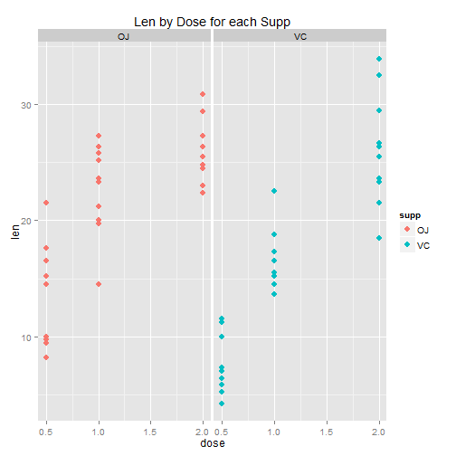

The project for the statistical inference class
========================================================
The project consists of two parts:

1. Simulation exercises.
2. Basic inferential data analysis.

# PART 2. Basic inferential data analysis.

## Load the ToothGrowth data and perform some basic exploratory data analyses


```r
library(datasets)
data = ToothGrowth
str(data)
```

```
## 'data.frame':	60 obs. of  3 variables:
##  $ len : num  4.2 11.5 7.3 5.8 6.4 10 11.2 11.2 5.2 7 ...
##  $ supp: Factor w/ 2 levels "OJ","VC": 2 2 2 2 2 2 2 2 2 2 ...
##  $ dose: num  0.5 0.5 0.5 0.5 0.5 0.5 0.5 0.5 0.5 0.5 ...
```

```r
library(ggplot2)

qplot(dose, len, data=data, color = supp, size = I(3), alpha = I(.7), main = "Len by Dose") +
    geom_smooth(method=lm, se = FALSE)
```

 

```r
qplot(dose, len, data = data, facets = .~supp, size = I(3), color = supp, main = "Len by Dose for each Supp")
```

 

```r
qplot(supp, len, data = data, color = dose, size = I(3), main = "Len by Supp")
```

 

```r
qplot(supp, len, data = data, color = dose, size = I(3), facets = .~dose, main = "Len by Supp for each Dose")
```

 

## Provide a basic summary of the data.
Summarizing data by supp and dose.  

```r
# By supp
OJ <- data[data$supp == "OJ", "len"]
oj.mean <- mean(OJ)
oj.sd <- sd(OJ)
VC <- data[data$supp == "VC", "len"]
vc.mean <- mean(VC)
vc.sd <- sd(VC)

# By dose
d05 <- data[data$dose == 0.5, "len"]
d05.mean <- mean(d05)
d05.sd <- sd(d05)
d1 <- data[data$dose == 1, "len"]
d1.mean <- mean(d1)
d1.sd <- sd(d1)
d2 <- data[data$dose == 2, "len"]
d2.mean <- mean(d2)
d2.sd <- sd(d2)

g1 <- qplot(OJ, binwidth = 0.5)
g2 <- qplot(VC, binwidth = 0.5)
g3 <- qplot(d05, binwidth = 0.5)
g4 <- qplot(d1, binwidth = 0.5)
g5 <- qplot(d2, binwidth = 0.5)

library(gridExtra)
```

```
## Loading required package: grid
```

```r
grid.arrange(g1, g2, g3, g4, g5, ncol = 2)
```

 
  
VC: mean 16.9633, sd 8.266.  
OJ: mean 20.6633, sd 6.6056.  
d05: mean 10.605, sd 4.4998.  
d1: mean 19.735, sd 4.4154.  
d2: mean 26.1, sd 3.7742.  

## Use confidence intervals and hypothesis tests to compare tooth growth by supp and dose.

Comparing VC and OJ using `t.test()`:  

```r
t.test(VC, OJ)
```

```
## 
## 	Welch Two Sample t-test
## 
## data:  VC and OJ
## t = -1.915, df = 55.31, p-value = 0.06063
## alternative hypothesis: true difference in means is not equal to 0
## 95 percent confidence interval:
##  -7.571  0.171
## sample estimates:
## mean of x mean of y 
##     16.96     20.66
```
  
Comparing different doses using `t.test`:

```r
t.test(d05, d1)
```

```
## 
## 	Welch Two Sample t-test
## 
## data:  d05 and d1
## t = -6.477, df = 37.99, p-value = 1.268e-07
## alternative hypothesis: true difference in means is not equal to 0
## 95 percent confidence interval:
##  -11.984  -6.276
## sample estimates:
## mean of x mean of y 
##     10.61     19.73
```

```r
t.test(d05, d2)
```

```
## 
## 	Welch Two Sample t-test
## 
## data:  d05 and d2
## t = -11.8, df = 36.88, p-value = 4.398e-14
## alternative hypothesis: true difference in means is not equal to 0
## 95 percent confidence interval:
##  -18.16 -12.83
## sample estimates:
## mean of x mean of y 
##     10.61     26.10
```

```r
t.test(d1, d2)
```

```
## 
## 	Welch Two Sample t-test
## 
## data:  d1 and d2
## t = -4.901, df = 37.1, p-value = 1.906e-05
## alternative hypothesis: true difference in means is not equal to 0
## 95 percent confidence interval:
##  -8.996 -3.734
## sample estimates:
## mean of x mean of y 
##     19.73     26.10
```
